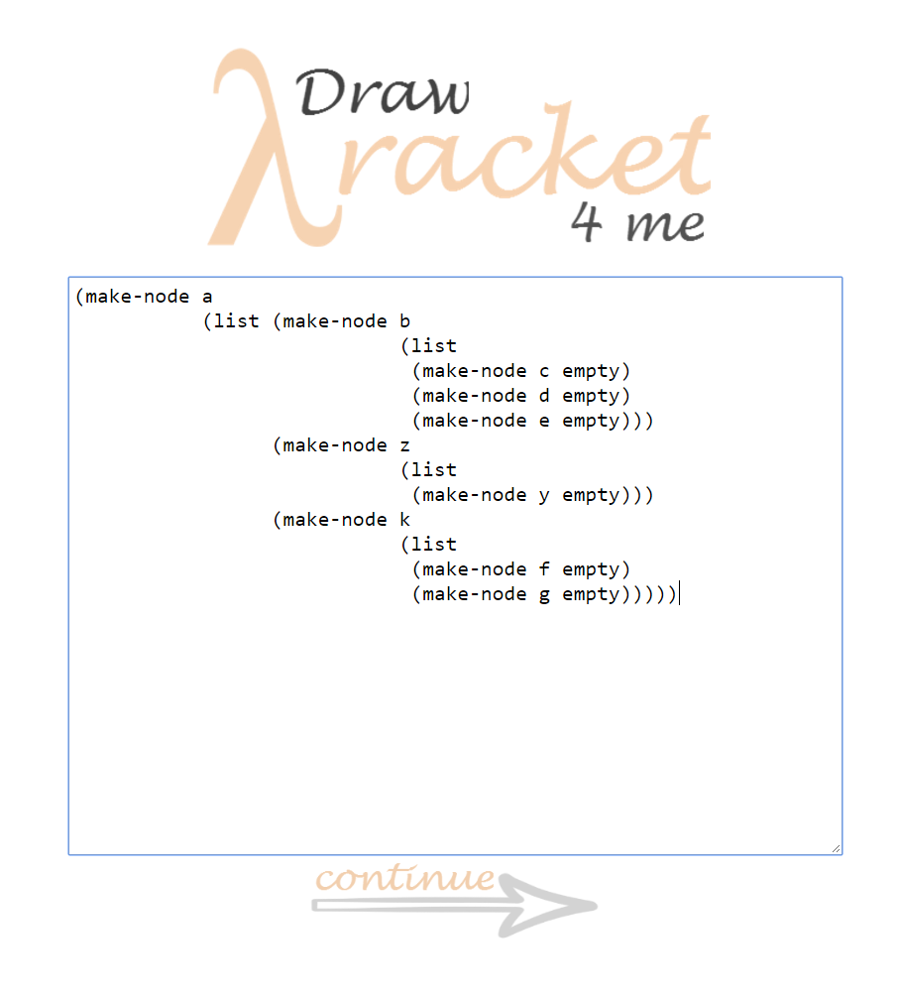
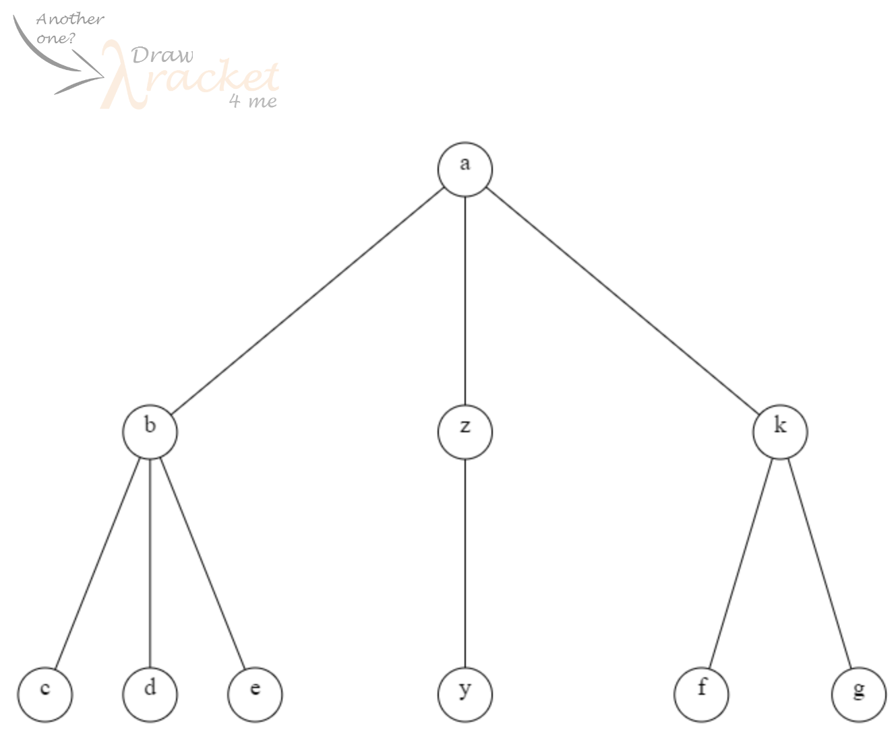
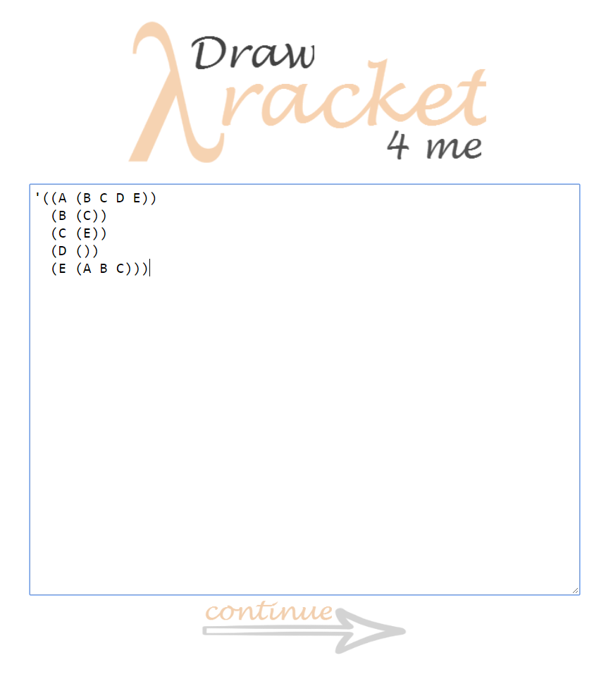
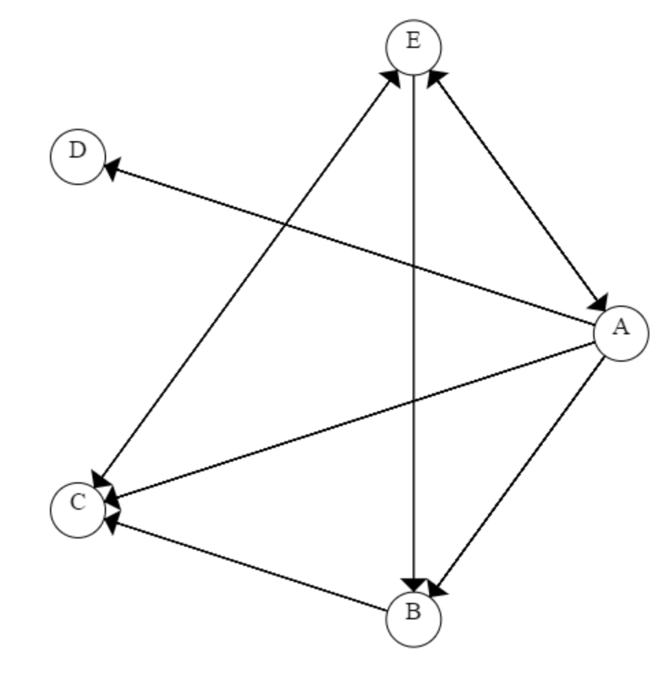

<h3 align = "center">

</h3>

<h3> What is it? </h3>
Hate Racket syntax? Have a ton of test cases for graphs and trees? 
We all know it's a waste of time drawing the diagrams out to verify whether our code is correct. 
**But don't worry, *DrawRacket4Me* got your back!**<br>
Simply copy and paste your code from DrRacket into DrawRacket4Me, it will automatically draw out the structure for you, whether it's trees with a list of children, or graphs with cycles. <br>

<h4> Here's an Example:</h4>
<table>
<tr>
<td> </td> <td>  </td>
</tr>
</table>

<h3> How to Run it? </h3>

<h4> Step 1:</h4>
Just `git clone` this repo and double click `start.html`, which will run the file on your favorite browser.
<table>
<tr>
<td width = "380px"> <h4> Step 2: </h4> Then you'll be prompted to select the type of diagram you want to draw. Just simply choose one of "N-children trees", "Binary Trees" or "Graphs", then the continue button will immediately appear.<br>
</td>
<td></td>
</tr>
<tr>
<td width = "380px"> <h4> Step 3: </h4> Next just copy and paste your code from DrRacket! You don't have to even worry about the formatting, just leave it as it is. If you've selected either Binary/N-Children Trees, you are required to input the identifier name. <br> </td>
<td></td>
</tr>
<tr>
<td width = "380px"> <h4> Step 4: </h4> DrawRacket4Me automatically opens a new window and draws diagram for you<br> </td>
<td></td>
</tr>
<tr>
<td width = "380px"> <h4> Step 5: </h4> Need to draw another one? Just click the faint icon at the top left corner and you'll be redirected to home.<br></td>
<td></td>
</tr>
</table>

<h3> Some notes (if clarification is needed) </h3>
1. <strong> What does N-Children Trees Mean? </strong> <br>
   N-Children Trees just means trees with a list of children, instead of only two. <br> <br>
2. <strong> Can I use N-Children Trees for Binary Trees? </strong> <br> The difference between Binary and N-Children Trees is that binary trees account for "empty" slots (meaning it will distinguish between left and right", while N-Children will just put all of its children in order from left to right. Therefore, if N-Children has only 1 child, it will put it directly under the parent, whereas for Binary Trees, it will look at whether it should be placed left or right. So your choice! <br> <br>
3. <strong> What if it doesn't draw for me? Or the diagram looks messed up? </strong> The likelihood is that there's some syntax error in your code, probably due to one of your bracket or a missing node. However I'm still an amateur programmer and this is one of my first projects. So feel free to contact me or even contribute to this repo if there is something wrong :). I would love to fix the problem!

<h1> Here comes some technical stuff... How is it built? </h1>
<h3> General Structure </h3>
The entire system comprises of only 5 files: `start.html`, `draw.html`, `logic.js`, `binary.js` and `graph.js`.
* `start.html`: basically the home page of the system. It's separated into two parts: html and an in-file `<script>`. The javascript included in this file does not contribute to the logic, only the UI. Shortly put, it basically makes DrawRacket4Me look pretty.
* `draw.html`: the entire page is pretty much an html5 canvas, with a logo that redirect back to `start.html`. It also has an in-file `<script>`, which calls functions from `logic.js`, `binary.js` or `graph.js`. 
* `logic.js`, `binary.js`, `graph.js`: you can look at these three files as the brain of the system. They include functions that parse through your racket code then design and draw the desired diagram for you.

<h3> Logic/Algorithm </h3>
1. **N-Children Trees** `logic.js`
   - Parsing:
      - Parsing process is separated into 5 stages:
      - Function `process(block, identity)` loops through every character of block, which is the code user has entered and determines which stage we should head to. For example, when we hit an open bracket, we need to immediately go to CONSTRUCTOR, because either "list" or "make" should follow. "Identity" is the identifier name, and is used to verify the syntax of user's Racket code.
      - While parsing, the function also collects useful information, which includes: data of each node, which layer the node is at and the node's path. Root has a path of "0"; the first child of root has a path of "00"; the third child of the second child of root has a path of "021". The benefit of this denotation is that we can easily deduce the path of a node's closest sibling and parent. For example, if a node's path is "03251", we know its parent has to be "0325"; its older sibling has to be "03250" and its younger sibling has to be "03256". This information is essential in locating where the node is. <br>
         - **How do we find layer and path?** <br>
            - We know that whenever we hit a `(list)` constructor, a new layer from the current layer has been opened. Let our current path be denoted `path[]`, then the very next node we are processing would have a path of `path.push(0)`, because it has to be the first child of the node we have just gone past by. <br>
            - Layers would keep opening until a closing bracket is hit, which means the node we have just processed is a leaf child (since it does not open a new list of children anymore). This implies that if the next non-space/newline character is an open bracket, we should head to CONSTRUCTOR and expect a `make-node`. This would be the previous node's sibling and its path would simply be `path[path.length-1] += 1'`, as forementioned. However what if the next character is also a close bracket? <br>
            - Here's the trick. The first open bracket will always be for constructing the actual node and the next one will always be for opening a new list. Since close brackets need to match up with open brackets, this means every odd index (starting from 1) of closing brackets would be closing a `make-node` while every even index of closing brackets would be closing a list, aka a layer. Now, if we know when the layer has been closed, we know everything because we can just `path.pop()` until the desired layer has been reached. <br>
            - When we reach the desired layer, our path at that type would simply be the node's closest, older sibling, and just as forementioned, we can get the current node's path. <br>
      - All of this useful information is stored in the `arguments[]` array. We then simply do some clean up of the information and stores it in a new `info[]` array, and pass the new array to `getSibling (info)`.
  - Get Coordinates:
      - **Feeding/Preparing the array:** This step makes our x-y coordinates calculation much easier. After preparation, for an arbitrary node, denoted `info[i]` looks like: `info[i][0]` contains the node's actual data, `info[i][1]` is node's path as string, `info[i][2]` stores the # of siblings for this node, `info[i][3]` is the width of the window this node should occupy which is yet to be calculated, `info[i][4]` is node's x-coordinate yet to be calculated and `info[i][5]` is the y-coordinate yet to be calculated. Now, for our root node `info[0]`, we know it occupies the entire window's width; its x-coordinate should be right in the middle (`window.innerWidth/2`) and we can set the y-coordinate to be an arbitrary value that looks good.
      - **Calculating the coordinates:** There are three cases:
         1. Current node has a `path.length` of previous node's `path.length + 1`. This implies this node is previous node's child. Recall that for the previous node, we would have the following information: its data; its path; its number of siblings the width of window it occupies; its x-coordinate and its y-coordinate, and for the current node, we know: its data; its path and its number of siblings. Thus to get the current node's x-coordinate, we simply get previous node's occupy width and divide it by current node's number of siblings. This is the new occupy width of our current node, and its x coordinate would simply be the at the middle of our first "chunk", which is expressed as new_x:
         ```javascript 
            var siblings = info[i][2];
            var index = parseInt(info[i][1].charAt(info[i][1].length-1));
            var layer = (info[i][1].length + 1)/2 - 1;
            var width = info[i-1][3];
            var x_coordinate = info[i-1][4];
            var occupy_width = width/siblings;

            var new_x = x_coordinate + (index - siblings/2 + 0.5)*occupy_width;
         ```
         2. Current node has the same `path.length` as the previous node. This implies that this node is previous node's sibling. To get its x-coordinate, we add a "width" to the previous node's x-coordinate.
         3. Neither! We must find one if the node's siblings (if we do a nested loop from index 0, we will always find the current node's oldest sibling). Just like the previous case, instead of adding 1x width, we add Nx width, where N is basically "how young" this node is relative to the oldest sibling (which has an N of 0).
      - All of this is then stored in the `info[]` array, which is then passed to `drawTree (info)`.
   - Draw diagram:
      - Drawing the lines: we must do this before drawing our circles (nodes) because the lines will overlap the circles and look ugly. Lines are always draw from the parent to its children. Thus for each node, we simply find its parent and draws it from the x,y coordinate of the parent to itself. To make the algorithm faster, we can test whether the parent is right before the current node, which decreases the amount of double looping needed. <br>
      - Drawing the nodes: basically using canvas to draw a circle, `filleStyle = "white"`. <br>
      - Putting down the data: gets the "letters" from our `info[]` and fills it onto the nodes. <br>
      
   - **AND THAT'S ALL FOR N-CHILDREN TREES!**
<br>
2. **Binary Trees** `binary.js`
   - Parsing:
      - Follows similar steps to how we would parse an N-Children Tree. However what's different this time is that instead of storing the path in the arguments while parsing, we process the path after all the arguments have been collected. The reason for doing so is that the concept of a binary tree and an N-Children tree is slightly different (read more on it in "notes" section). A typical racket code for a binary tree with a root and right child looks like `(make-node a empty (make-node b empty empty))`. It could also look like `(make-node a 1 empty (make-node b 2 empty empty))`. Thus unlike N-Children trees, "empty" could be seen as a constructor, but without an opening bracket. Therefore there's no way of us knowing whether the character we are processing at the moment belongs to the data (e.g. "a", or the key-value pair "a, 1") or signifies that it's an empty node (unless we set an accumulator but that's messy). So here's my strategy:
      - We parse through the racket code and collect every single argument just like we would do in N-Children trees, where whenever we hit a space, we place a "," and adds the character to the current argument, until we hit an opening bracket; then we add the rest of the arguments to a new array. For example if we have `(make-node a 1 empty (make-node b 2 empty empty))`, our `arguments[]` would look like `arguments[0] = "a,1,empty"`, `arguments[1] = "b,2,empty,empty"`. 
      - Here's an important case to consider: `(make-node a (make-node b (make-node c empty empty) empty) empty)`; our `arguments[]` would look like: `arguments[0] = "a"`, `arguments[1] = "b"`, `arguments[2] = "c,empty,empty"`, `arguments[3] = "empty"` and `arguments[4] = "empty"`. We will come back to this one later.
   - Processing the arguments:
      - This is the stage where we get the path of each node. Since we are reusing our drawing strategy from N-Children trees, our denotation for the paths has to be the same. The difference here is "empty" would be treated as a child. So even if a node has no siblings, if it were to be placed on the right side, it would have an index of "1". 
      - The thing to remember here is when we are looping through each argument, we are actually finding the path for the next node. For example if the current argument we are processing has no "empty" string, we know that the very next node has to be its child, placed at the left. Then clearly there emerge 3 cases:
         1. No "empty": <br>
            As forementioned, the very next node is the left child so we append "0" to the path.
         2. One "empty": <br>
            This means the very next node would be likely be the right child. However going back to our important case, we see that there exist 2 edge cases. One of them been that the entire argument itself == "empty" and the second one is that the very next argument also == "empty". So in our first edge case (where the very next argument is a filled node), we need to set a counter++, because the very next argument would need to find the closest node, while deducting the counter by 1, that has no "empty" and the counter == 0, which would be its parent. We then append "1" to it because it has to be a right child. Here's the code:
            ```javascript
             else if (countEmpty == 1){
               //the next node is the right child unless it's completely empty

               if(node == "empty"){
                 //meaning the right side of arguments[i-1] is empty (filled); thus the very next argument has to find the first element                    with 0 empty while count == 0;
                 if(next == "empty"){
                   count++;
                   continue;
                 }else{
                   var tmp = count;
                   for (var j = i-1; j >= 0; j--){
                     var prev = arguments[j];
                     var countEmptyII = (prev.match(/empty/g)  || []).length;
                     if(countEmptyII == 0){
                         if (count == 0){
                           path[i+1] = info[j][1] + ",1";
                           info[i+1] = new Array(next, path[i+1], 2, window.innerWidth, window.innerWidth, window.innerHeight);
                           arguments[j] = arguments[j] + ",empty";
                           console.log(arguments[j]);
                           count = tmp;
                           break;
                         }else{
                           count--;
                         }
                     }
                   }
                 }
               }
              ```
           If the next argument is also empty, we add1 to the counter and continue.
        3. Two "empty": <br>
           This just means that this node is a leaf node. Thus the path for the very next argument, we need to do the same as the previous case and find the right parent by manipulating the counter. The reason we set a "tmp" to the counter is that we don't want to lose our "count" everytime we have to go back.
     - After this process, we would have our path, which has the exact same denotation as what we had for Binary Trees.
  - Then getting the x,y coordinate and drawing the actual tree becomes a piece of cake; we are just reusing the same code as what we had before! <br>
  
3. dafd 
  
            
   
      
