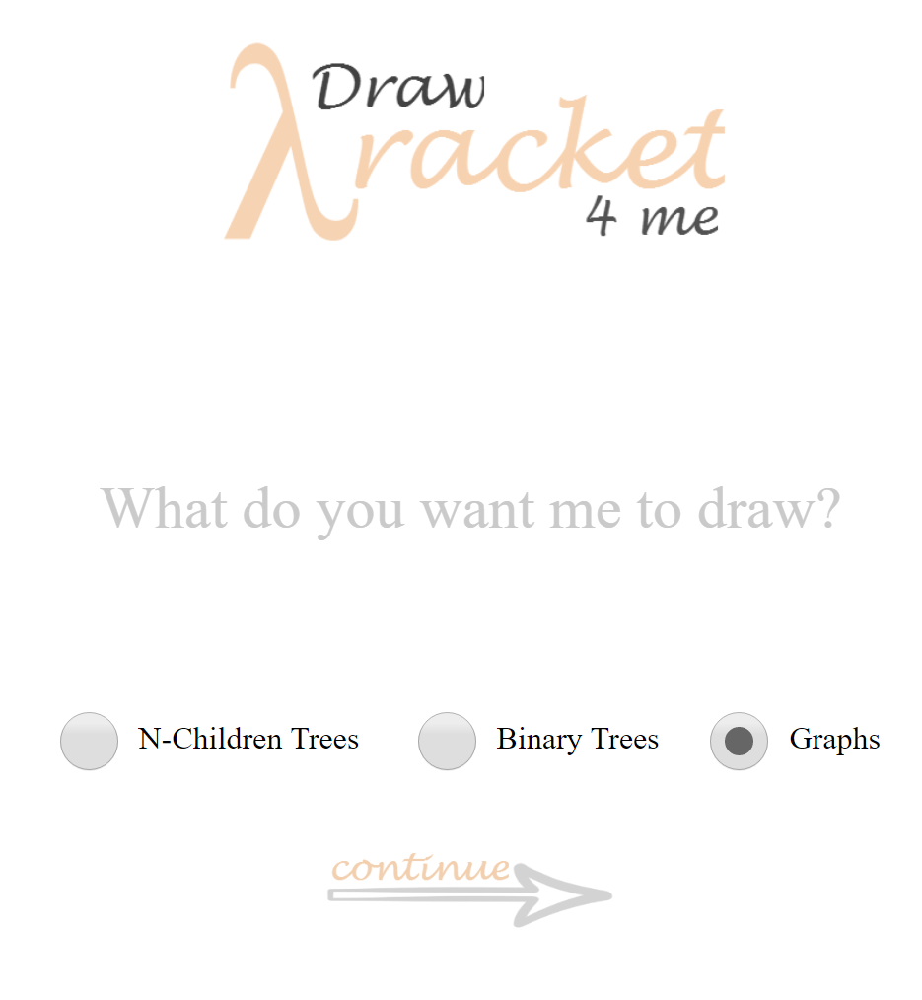

<h3 align = "center">

</h3>

<h3> What is it? </h3>
Hate Racket syntax? Have a ton of test cases for graphs and trees? 
We all know it's a waste of time drawing the diagrams out to verify whether our code is correct. 
**But don't worry, *DrawRacket4Me* got your back!** 
Simply copy and paste your code from DrRacket into DrawRacket4Me, it will automatically draw out the structure for you, whether it's trees with a list of children, or graphs with cycles.  

<h4> Here's an Example:</h4>
<table>
<tr>
<td> </td> <td>  </td>
</tr>
</table>

<h3> How to Run it? </h3>
**EZ.**
<h4> Step 1:</h4>
Just `git clone` this repo and double click `start.html`, which will run the file on your favorite browser.
<table>
<tr>
<td width = "380px"> <h4> Step 2: </h4> Then you'll be prompted to select the type of diagram you want to draw. Just simply choose one of "N-children trees", "Binary Trees" or "Graphs", then the continue button will immediately appear. 
</td>
<td></td>
</tr>
<tr>
<td width = "380px"> <h4> Step 3: </h4> Next just copy and paste your code from DrRacket! You don't have to even worry about the formatting, just leave it as it is. If you've selected either Binary/N-Children Trees, you are required to input the identifier name.   </td>
<td></td>
</tr>
<tr>
<td width = "380px"> <h4> Step 4: </h4> DrawRacket4Me automatically opens a new window and draws diagram for you  </td>
<td></td>
</tr>
<tr>
<td width = "380px"> <h4> Step 5: </h4> Need to draw another one? Just click the faint icon at the top left corner and you'll be redirected to home. </td>
<td></td>
</tr>
</table>

<h3> Some notes (if clarification is needed) </h3>
1. <strong> What does N-Children Trees Mean? </strong>  
   N-Children Trees just means trees with a list of children, instead of only two.    
2. <strong> Can I use N-Children Trees for Binary Trees? </strong>   The difference between Binary and N-Children Trees is that binary trees account for "empty" slots (meaning it will distinguish between left and right", while N-Children will just put all of its children in order from left to right. Therefore, if N-Children has only 1 child, it will put it directly under the parent, whereas for Binary Trees, it will look at whether it should be placed left or right. So your choice!    
3. <strong> What if it doesn't draw for me? Or the diagram looks messed up? </strong> The likelihood is that there's some syntax error in your code, probably due to one of your bracket or a missing node. However I'm still an amateur programmer and this is one of my first projects. So feel free to contact me or even contribute to this repo if there is something wrong :). I would love to fix the problem!

<h1> Here comes some technical stuff... How is it built? </h1>
<h3> General Structure </h3>
The entire system comprises of only 5 files: `start.html`, `draw.html`, `logic.js`, `binary.js` and `graph.js`.
* `start.html`: basically the home page of the system. It's separated into two parts: html and an in-file `<script>`. The javascript included in this file does not contribute to the logic, only the UI. Shortly put, it basically makes DrawRacket4Me look pretty.
* `draw.html`: the entire page is pretty much an html5 canvas, with a logo that redirect back to `start.html`. It also has an in-file `<script>`, which calls functions from `logic.js`, `binary.js` or `graph.js`. 
* `logic.js`, `binary.js`, `graph.js`: you can look at these three files as the brain of the system. They include functions that parse through your racket code then design and draw the desired diagram for you.

<h3> Logic/Algorithm </h3>
<ul> <strong> N-Children Trees </strong> `logic.js`: 
   <li> `process (block, identity)` parses through your racket code. Identity is your identifier name and is used to check if your syntax is correct. Parsing process is separated into 5 stages: `OPENBRACKET: 1`, `CONSTRUCTOR: 2`, `IDENTIFIER: 3`, `ARGUMENTS: 4`, `CLOSEBRACKET: 5`. Function will check for the current character been parsed and make the right decisions. For example, when we hit the word "make", we go to CONSTRUCTOR; when we hit a space during IDENTIFIER, we immediately go to ARGUMENTS. While parsing, it also stores useful information of the node in an array called `arguments[]`. The useful information includes the keys and/or values for each node, which layer the node is in, as well as the node's "path". The path for root is "0"; the path for the 1st child of root is "00"; the path for the 3rd child of the 2nd child of root would be "012".
    <ul>  
    <li> <strong> Why are path and layer needed? </strong>   
          Because we need them to determine who their siblings and their parents are. For example, if a node's path is "0231", we know that its parent has to be "023" and its neighbour siblings are "0230" and "0232". This is needed to determine where we should draw the node and lines on canvas. </li>   
   <li> <strong> How did we find path and layer? </strong>   
          Finding the path implies that we have found the layer, because we know if path is a string/array of length 'n', we know it's at the nth layer, if root is at layer 1 (or n-1th layer, if root is at layer 0). So here's the trick.  
          When parsing through the code, whenever we hit the word `list` in our CONSTRUCTOR stage (as forementioned), we know that the layer has increased by 1. Therefore we must `path.push(0)`, since the first item of every list is always the first child of the previous node, where the previous node has an arbitrary `path[]`. When we hit a close bracket, this means the current node has been "closed", or there are no children stemming from this node anymore. We must immediately `path.pop()`, which returns to the previous "layer", or the path of the parent, because the next node is likely to be this node's sibling, or a closing bracket.  
          There's an interesting thing about closing brackets for N-Children Trees.          
                 
           
          
